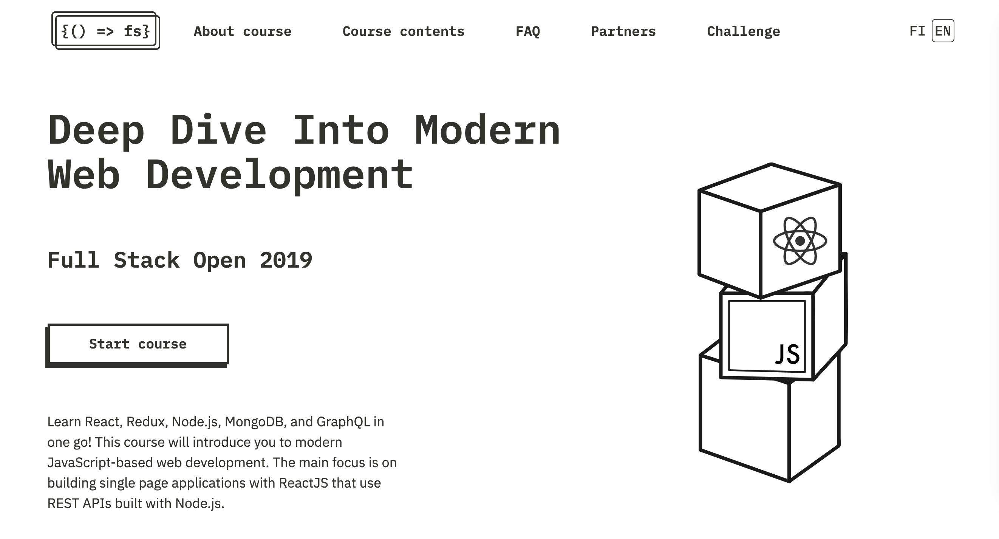

# FSO2019-2

SPA w/ ReactJS that use REST APIs built with Node.js (https://fullstackopen.com/en)

---

## Part 3: Programming a server with NodeJS and Express

- a. Node.js and Express 
- b. Deploying app to internet
- c. Saving data to MongoDB 
- d. Validation and ESLint